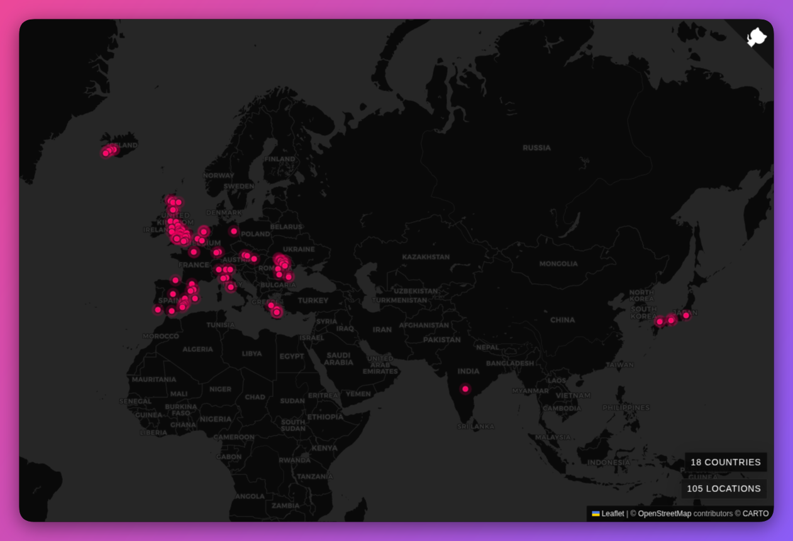

# Travels Map

[](https://opensource.org/licenses/MIT)

Reusable travel map web component for any website.



See a live demo here: [here](https://robertmarsal.com/travels)

## What it is

This package exposes a custom element:

```html
<travels-map></travels-map>
```

It is framework-agnostic, so it can be used in plain HTML, React, Vue, Svelte,
Astro, or any other frontend that can load a browser module.

## Installation

```sh
npm install travels-map
```

## Local development

```sh
git clone https://github.com/robertmarsal/travels.git
cd travels
npm install
npm run dev
```

## Demo

The repository includes a local demo app for development and manual testing.

Run it with:

```sh
npm run dev
```

Then edit [`src/demo/data.ts`](./src/demo/data.ts) to change the sample points
shown in the demo.

## Usage

### Plain HTML with remote JSON

```html
<travels-map
    data-src="/travels.json"
    theme="dark-monochrome"
    marker-color="#ff0066"
    center="38.957083,-39.074225"
    zoom="3"
    show-legends="true"
></travels-map>

<script type="module" src="/dist/travels-map.js"></script>
```

Your JSON can be either:

```json
{
  "points": [
    { "lat": 51.500736, "lng": -0.124625, "title": "London - United Kingdom" }
  ]
}
```

or a raw array of point objects.

### JavaScript property API

```js
import "travels-map";

const map = document.querySelector("travels-map");
map.markerColor = "#00d1b2";
map.points = [
    { lat: 51.500736, lng: -0.124625, title: "London - United Kingdom" },
];
```

## Public API

Attributes:

- `data-src`: URL returning JSON data
- `theme`: currently `dark-monochrome`
- `marker-color`: optional CSS color for the dots
- `center`: fallback map center as `"lat,lng"`
- `zoom`: fallback zoom level when there are no points
- `show-legends`: set to `"false"` to hide legends
- `tiles-url`: optional custom tile URL template

Properties:

- `points`: array of `{ lat, lng, title }`
- `markerColor`: optional color string for the dots

Styling:

- The component uses shadow DOM.
- You can theme it with CSS custom properties on `travels-map`, such as
  `--travels-marker`, `--travels-panel-bg`, and `--travels-map-bg`.
